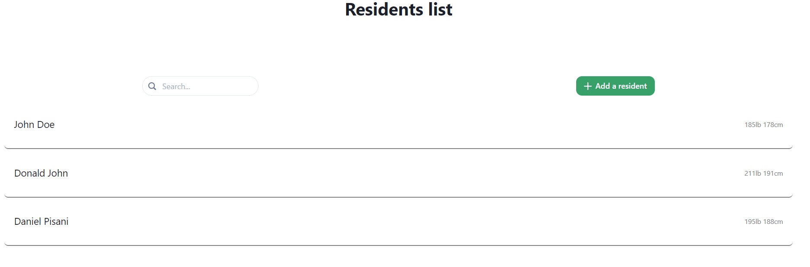
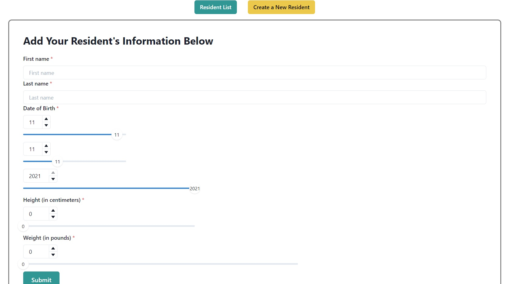
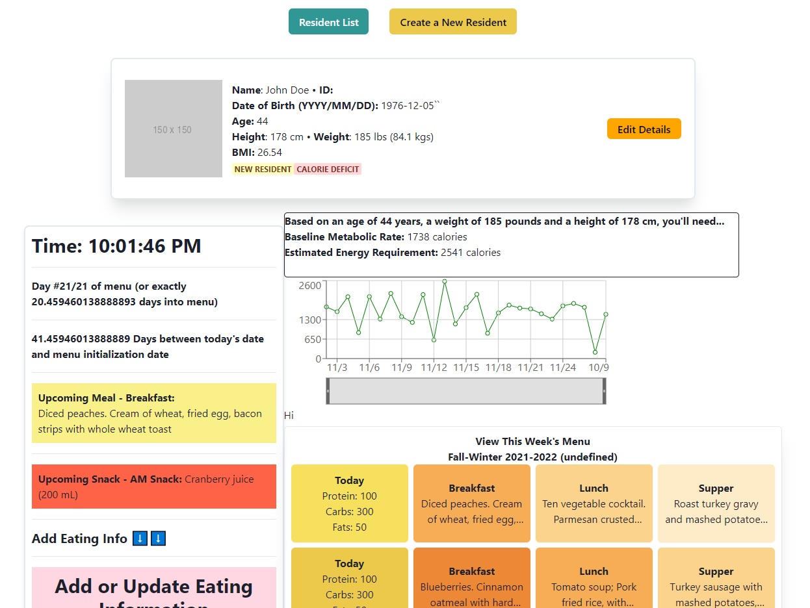

# Long-Term Care Eating Tracker - React & Next.js
> [A way for nursing staff to tracking the eating of their residents](https://v34-bears-team-06.netlify.app//)

## Contributors
Rubén Paredes (Ruberoni)
Daniel Pisani (WellAndGood)

## Contribution 🤝
All further contributions are welcome.

## Appearance Upon Deployment

### Resident's List Appearance

### Create a New Resident

### Unique Resident's Dashboard

## Goals 🚩
- [X] Reinforce React features
- [X] Learn Next.js
- [X] Create an improvement to the existing technologies for tracking a long-term-care resident's appetite.

## Higher-Purpose for this Application
Existing long-term-care/nursing homes often use EMRs (electronic medical records) to track the day-to-day well-being of their residents. This includes their weight, skin, appetite, medication, and other factors.

The issue with existing EMRs is that they are a useful way to collect and display a lot of information; the problem is that this information is not integrated or organized to present useful data insights for the user (usually a clinician or trained professional). This leads to a loss of productivity, spent in hours doing data collection and fact-finding.

Our application seeks to short-cut this process of data collection by doing all of the leg-work for the users. How? By:
- Integrating the home's menu with the resident's eating (this is surpringly not done in most cases)
- Attaching eating information to each meal from its menu; and so, if a resident eats 75% of a breakfast that has 400 calories, then we know that they have eaten 300 calories.
- Presenting an eating history through a highly-visible graph.
- Presenting basic data about the resident's calorie needs.
- Presenting information about the menu and the upcoming meals over the coming days.
- Granting the ability to easily update the resident's eating history.

## Features 🏏
- [X] Resident's list: View existing residents in a list; select one to be taken to their dashboard
- [X] Create a resident: You can create a new resident by filling out a form; after this, they will have their own independent dashboard.
- [X] Resident dashboard: You are shown their basic health information - height, weight, date of birth - as well as the (above-stated) graph, calorie needs, menu information, and clickable buttons to add/update the resident's eating history.
- [X] Data insights: So far, you are given the resident's calorie information and eating information (presented via a graph)

## Dependencies 🧠
### Client side
- React.js
- Related libraries (React-Dom, React-Hook-Form, React-Router)
- Chakra-UI
- Moment.js

### Server side
- MongoDB
- Mongoose
- Node.js

# Attribution 🤼‍♂️
This application has been made using the above libraries and languages, as well as their documentation.

# Contact us! 📞

## Rubén
Email me: [ruben.pardes25@gmail.com](mailto:ruben.pardes25@gmail.com)\
Discord: Ruberoni#8428

## Daniel
Email me: [daniel.pisani.coding@gmail.com](mailto:daniel.pisani.coding@gmail.com)\
Discord: F34rTh3R34er#4723
